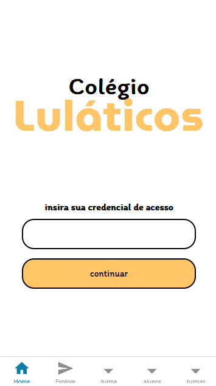
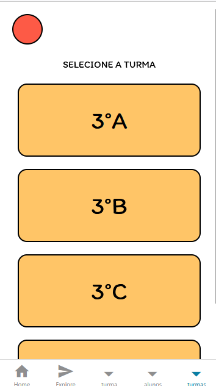
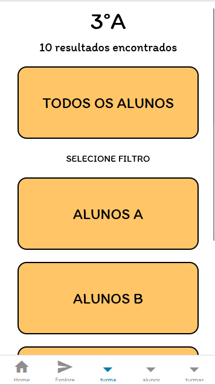
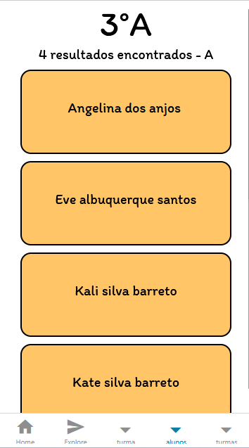

# ˚₊⊹Projeto Controle de presenças˚₊⊹

### (PROJETO EM ANDAMENTO: Sujeito a mudanças)
### O propósito do nosso projeto é ser um aplicativo de monitoramento de presenças e faltas em escolas, sendo separado em turmas com alunos. Dedicado a professores, educadores e pedagogos. A estrutura base do nosso app consiste em 4 páginas principais: a página de credenciais (onde o professor preenche sua credencial e entra no app), a aba de turmas (onde ficam armazenadas todas as turmas de alunos), a aba de identificação por letra (identifica os alunos em ordem alfabética pela inicial do nome) e a aba de alunos (na qual aparecem os alunos e suas respectivas presenças e faltas).

# Para acessar nossa documentação do projeto:

[⤷ ゛Cʟɪǫᴜᴇ ᴀǫᴜɪˎˊ˗~](https://docs.google.com/document/d/1_p7r1BwdWYCoX06bUXzWqbEo8U0maUK2-Tbpgf5OkJc/edit?tab=t.0#heading=h.w56togq51wl9)

# Para acessar a nossa prototipagem feita no Figma:

[⤷ ゛Cʟɪǫᴜᴇ ᴀǫᴜɪˎˊ˗~](https://www.figma.com/design/1JKNk5A9REBR8Fku700Cne/TRABALHO---1TRI?node-id=0-1&t=Y443lzLqHYYLAwbX-0)

# Lista de tecnologias utilizadas no código:

- Figma (prototipagem)
- GitHub
- Python
- React Native
- JavaScript
- Postman

# ˚₊⊹Tela inicial - Credenciais

## Componentes da página:
- Título (nome da escola/logo)
- Fontes personalizadas
- Campo para colocar a credencial (apenas números)

## Dificuldades:
- Adicionar as fontes no código
- Centralizar os blocos de texto
- Fazer o input no campo das credenciais

# ˚₊⊹Turmas - Página do inicial do professor

## Componentes da página:
- Círculo do perfil
- Blocos específicos de cada turma

## Dificuldades:
- Retirar os códigos que já vêm com o React Native
- Descobrir como fazer o círculo

# ˚₊⊹Turma - vizualização da classe selecionada

## Componentes da página:
- Texto indicando a turma selecionada
- Filtro que separa a turma específica escolhida pelo professor (vizualizar a turma inteira ou por ordem alfabética)

## Dificuldades:
- Retirar os componentes que já vêm com o React Native
- Centralizar os componentes

# ˚₊⊹Alunos - Filtro selecionado pelo professor

## Componentes das páginas:
- blocos de alunos
- Título da turma selecionada
- Subtítulo (quantidade de alunos na turma)

## Dificuldades:
- Conflito nos Commits
- Flexbox

